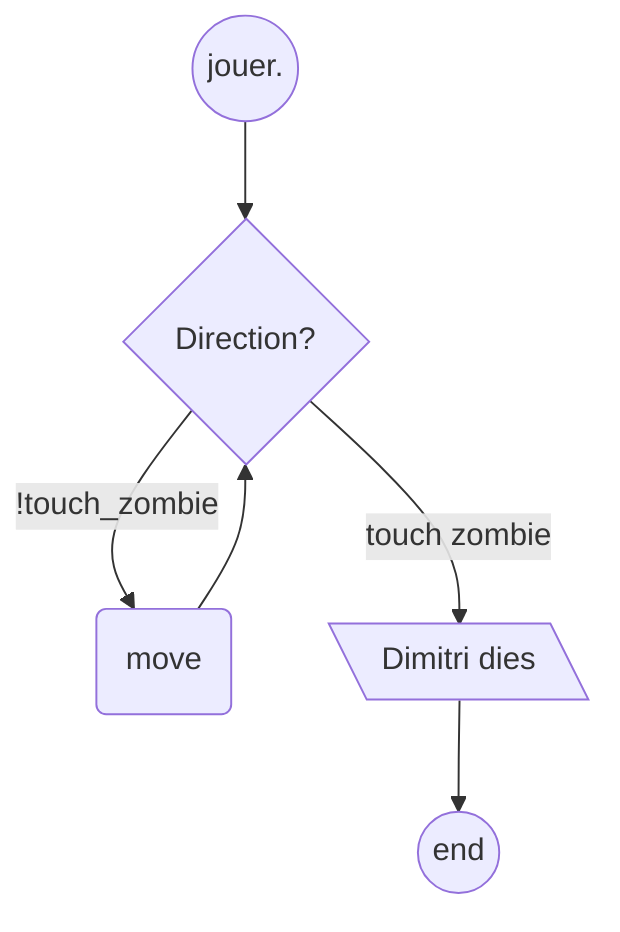

# Zombie Cows
A mini-project that we worked on during our *Logic Programming* workshop at INSAT.
 
It is implemented in Prolog using __SWI Prolog__!

## To play:
Open SWI Prolog and consult the file.
 
Type *jouer*.
 
And then type either *nord*, *sud*, *est*, *west* or *reste*.

## Flowchart

## Demo:

 

  

## Have fun!